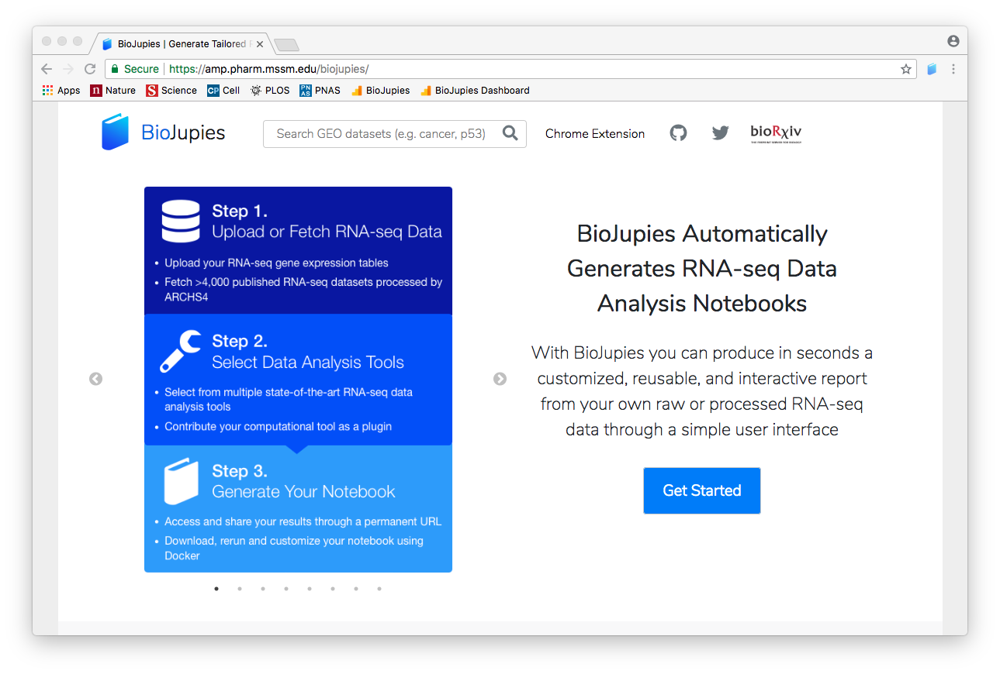
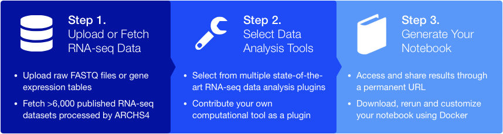
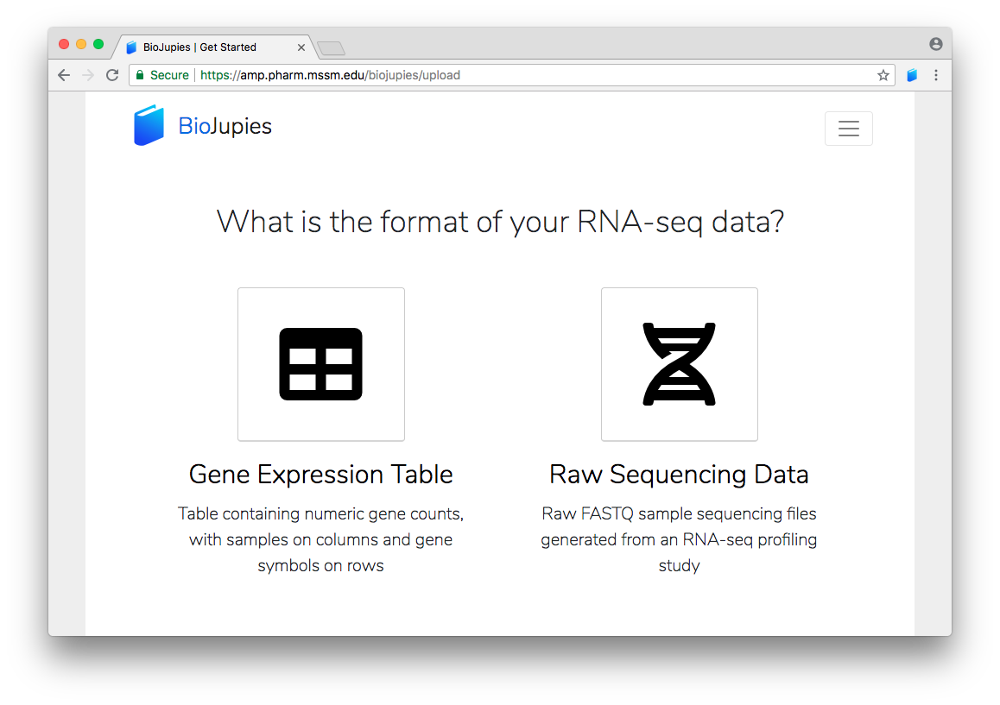
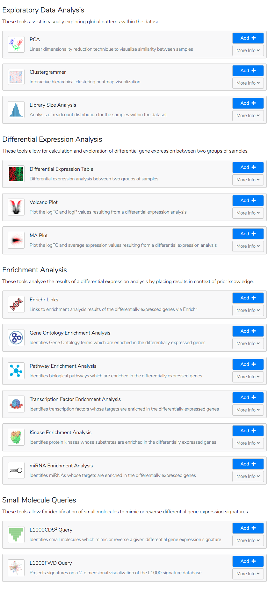
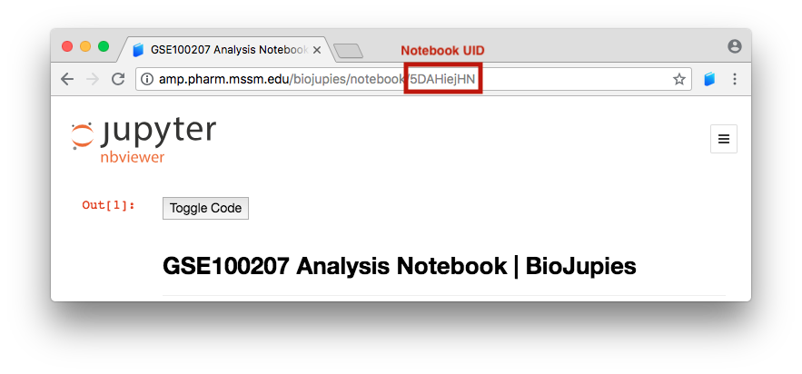
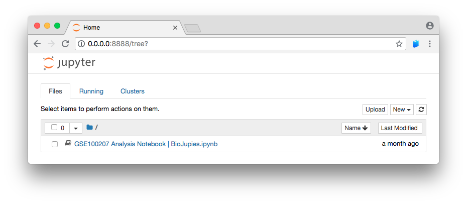
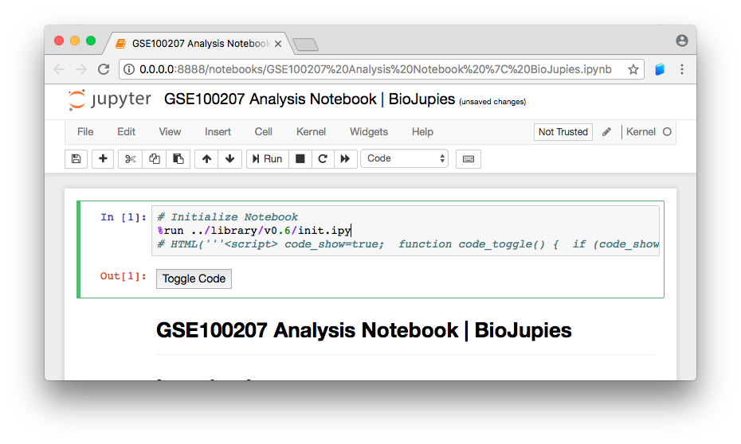

# BioJupies


Automated generation of Jupyter Notebooks for RNA-seq data analysis via user interface (http://biojupies.cloud).

Source code for the RNA-seq analysis plugins available at https://github.com/MaayanLab/biojupies-plugins.

### Overview
1. [What is BioJupies?](#what-is-biojupies)
2. [How can I generate notebooks using BioJupies?](#how-can-i-generate-a-notebook-using-biojupies)
3. [How can I upload my own RNA-seq data to BioJupies?](#how-can-i-upload-my-rna-seq-data-to-biojupies)
4. [What analyses can BioJupies perform?](#what-analyses-can-biojupies-perform)
5. [Can I contribute my RNA-seq analysis tools?](#can-i-contribute-my-rna-seq-analysis-tools)
6. [How can I download and rerun my notebooks?](#how-can-i-download-and-rerun-my-notebooks)
7. [References](#references)

## What is BioJupies?
BioJupies is a web server which allows users to automatically generate Jupyter Notebooks from RNA-seq datasets through an intuitive interface, with no knowledge of coding required. It can be accessed for free from http://biojupies.cloud.


## How can I generate a notebook using BioJupies?

Generating a notebook using BioJupies requires three steps:



1. First, **select an RNA-seq dataset** you with to analyze. You can upload FASTQ files, gene expression tables, or use a search engine to browse over 6,000 public datasets published in the [Gene Expression Omnibus](https://www.ncbi.nlm.nih.gov/geo/) and processed by [ARCHS4](https://amp.pharm.mssm.edu/archs4/).
2. Second, **add one or more computational tools** to analyze the data. BioJupies currently supports 14 plugins to perform exploratory data analysis, differential gene expression, enrichment analysis, and small molecule queries.
3. Third, **generate the notebook** with the desired settings. The notebook will be served to you through a URL, and can be easily downloaded and rerun on your local computer.

<br>

## How can I upload my RNA-seq data to BioJupies?
Users can upload their RNA-seq datasets for analysis at https://amp.pharm.mssm.edu/biojupies/upload.



BioJupies currently supports uploading **RNA-seq datasets in the FASTQ format** or **tables of gene-level counts**.

**Note**: While the user may successfully generate a notebook from normalized gene expression counts or microarray data tables, the tools are **NOT** yet optimized to handle such data. Such results should be interpreted with caution.

The Enrichment Analysis and Small Molecule Query plugins currently support datasets uploaded with **gene symbols** as row identifiers. When uploading datasets with different identifiers (e.g. ENSEMBL IDs, Entrez IDs), please note that these plugins may return empty results.

<br>

## What analyses can BioJupies perform?
BioJupies currently provides **14 RNA-seq data analysis plugins**, divided 
into four categories. For more information about the plugins, visit https://github.com/MaayanLab/biojupies-plugins.



## Can I contribute my RNA-seq analysis tools?
Developers are welcome to contribute their own RNA-seq data analysis plugins for integration in BioJupies. Once integrated, the plugin will be made available to all users for notebook generation and published on the BioJupies plugins [GitHub repository](https://github.com/MaayanLab/biojupies-plugins).

To contribute your plug-in, please visit https://amp.pharm.mssm.edu/biojupies/contribute.

<br>

## How can I download and rerun my notebooks?
After generating a notebook, users can download and execute it locally using the `maayanlab/biojupies-notebooks` Docker container.

To do this, the following steps are required:
1. Pull the latest version of the Docker container from the console:

``` bash 
docker pull maayanlab/biojupies-notebooks
```

2. Identify the notebook's unique ID (a 9-character alphanumeric string) from its URL - e.g. `5DAHiejHN`.



3. Launch the Docker container.

``` bash 
docker run -it -p 8888:8888 -e NOTEBOOK_UID=5DAHiejHN maayanlab/biojupies-notebooks
```

**Note: replace `5DAHiejHN` with the UID of the notebook you wish to rerun.**

4. Access the local Jupyter Notebook server from your browser at port 8888.



5. Execute and customize your notebook from the Jupyter server.



For more information about reusing notebooks, see https://amp.pharm.mssm.edu/biojupies/docker.

<br>

## References
BioJupies is available as a pre-print on **BioRxiv**:
[BioJupies: Automated Generation of Interactive Notebooks for RNA-seq Data Analysis in the Cloud](http://dx.doi.org/10.1016/j.cels.2018.10.007) Torre, D., Lachmann, A., and Ma’ayan, A. (Cell Systems, 2018)

## License
This project is licensed under the Apache-2.0 License - see the [LICENSE.md](LICENSE.md) file for details